# Manual de usuario del Sitio Web: Subproyecto 3.3 del Atlas Meteorológico del Golfo de México para plantear escenarios de derrames 

## Introducción
Este manual describe la funcionalidad, navegación y contenido del sitio web, para la descarga de series de datos que forman parte de la climatología del Atlas Meteorológico del Golfo de México para plantear escenarios de derrame. El usuario puede consultarlo para familiarizarse con el sitio, así como hallar información detallada de interés. El contenido del sitio web que se describe a continuación forma parte del subproyecto 3.3 (Modelación numérica regional de la atmósfera sobre el Golfo de México) de la Línea 3 de tal proyecto.

## **Funcionalidades actuales del sitio creado para la descarga de series de tiempo**

El acceso a la página tiene su panel en el sitio https://pronosticos.atmosfera.unam.mx/atlasmeteorologico.gom/

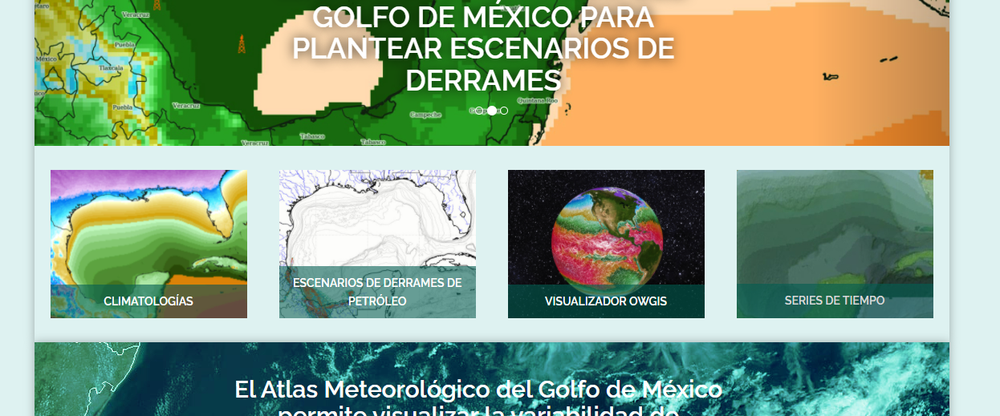

1. Al hacer click, cambia de ventana a una donde se puede observar el mapa base de Google Earth. Con un recuadro se indica toda el área de donde es posible descargar datos.

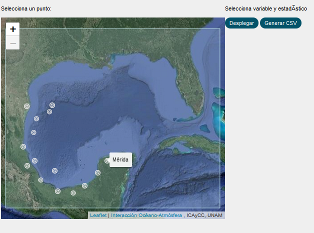

Este mapa tiene la opción de acercar o alejar la imagen a través de un control ubicado en la esquina superior izquierda 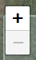

2. Para comenzar, se debe hacer click en cualquier lugar del mapa. Se ha habilitado la opción de escoger más de un punto para desplegar los parámetros deseados (por punto),

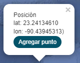

3. Al dar click en "**Agregar punto**" se coloca automáticamente un marcador indicando el punto sobre el mapa  y aparece el siguiente menú:

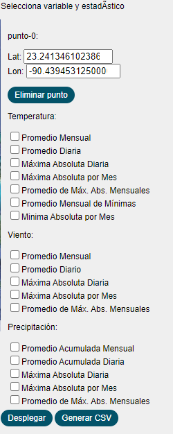
  
  En la parte superior de  este menú, se despliega un campo editable con la coordenada elegida 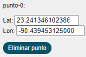. la coordenada elegida no es la deseada, en el campo editable se pueden modificar los valores de latitud y longitud, ya sea directamente de manera manual o haciendo click en las flechas que indican hacia arriba o abajo,
  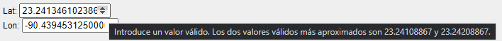

En ese caso, se despliega un recuadro indicando la siguiente leyenda: *Introduce un valor válido. Los dos valores válidos más aproximados son: num y num*. Es posible tomar esos valores o unos que se ajusten más a las necesidades requeridas

  Debajo se muestra la lista de estadísticos disponibles para las variables de **Temperatura**, **Viento** y **Precipitación**.

4. Se seleccionan los parámetros deseados (para el presente ejemplo se han seleccionado los **Promedios Diarios** para cada variable),

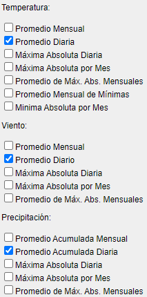

y se presiona el botón 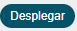 para que se muestre una gráfica que muestre tales parámetros como se muestra a continuación,

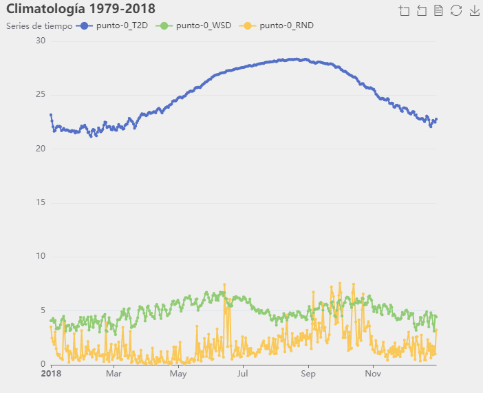

De igual manera, al posicionarse en algún punto de la gráfica, automáticamente se pueden visualizar los datos relacionados a ese punto en específico,

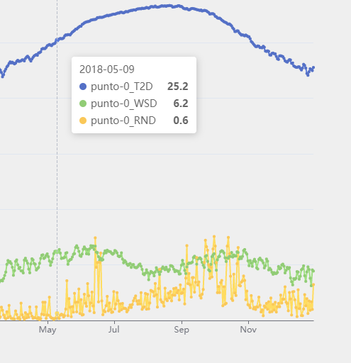

Se debe tener en cuenta que al modificar manualmente algún punto (la coordenada) se debe presionar el botón de **Desplegar** de nuevo para que la gráfica se actualice.

5. La descarga de los datos que se seleccionaron en el punto 3 se realiza al presionar botón que aparece junto al despliegue de datos, 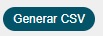,la cuál se realiza en un formato CSV. El formato CSV es posible visualizarlo en un procesador de textos o editor de hojas de cálculo,

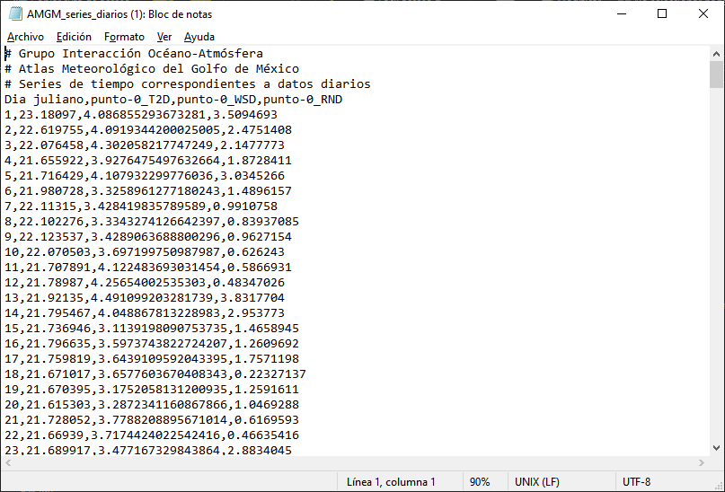

6. En el caso de elegir varios puntos, se colocan las marcas correspodientes sobre el mapa y los páneles con parámetros se verían así para *tres* puntos seleccionados,

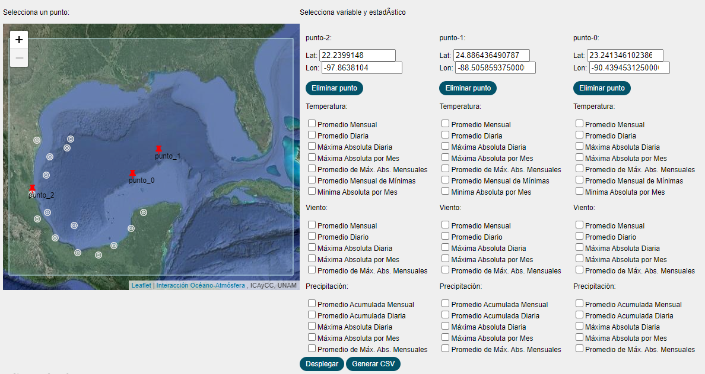

Al deplegar la gráfica, en este caso se han seleccionado todos los **Promedios diarios** de las tres variables, se obtienen nueve curvas como se muestra a continuación,

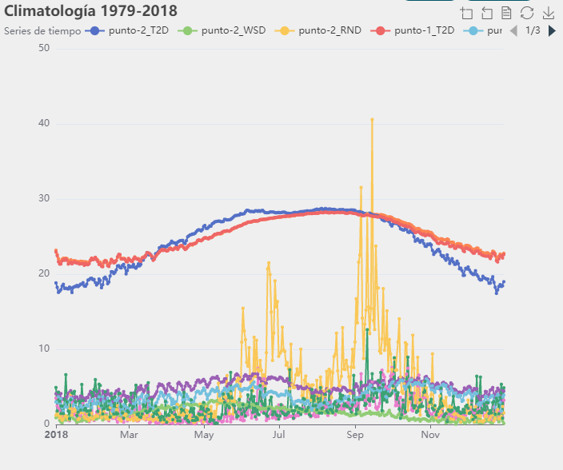

Las series de datos seleccionadas se pueden descargar con el botón **Generar CSV**. Los nombres de los archivos descargados contarán con el prefijo: **AMGM_series_** seguido por la palabra *diarios* o *mensuales*.csv. Dependiendo de las características de la variable deseada, es donde se ubicará dentro de los archivos.

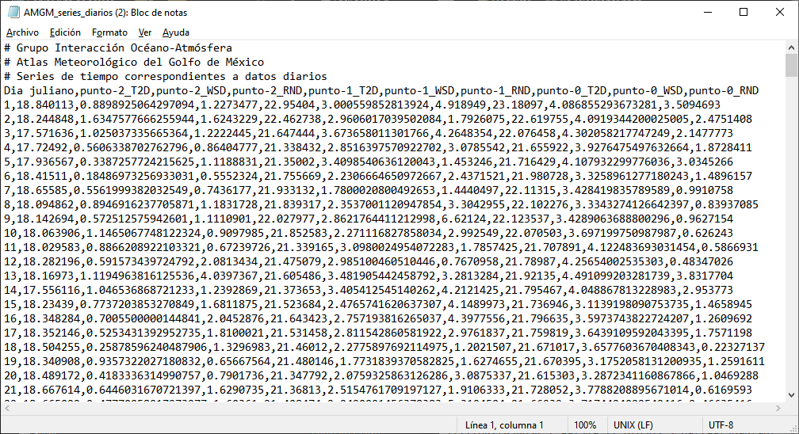

En caso de que no se deseen los datos en formato CSV, cada gráfica tiene la opción para mostrar los datos graficados, en un menú ubicado en la esquina superior derecha,

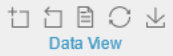

Al hacer click en **Data View**, se despliegan los datos con un formato plano que es posible copiar directamente a cualquier editor de textos,

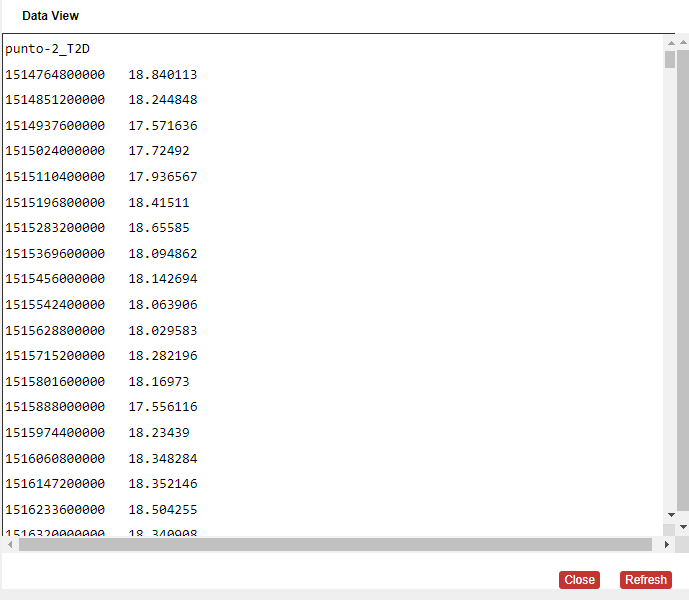

7. Para descargar el gráfico, se da click en el menú ubicado en la esquina superior derecha junto a Data View, en *Save as* 

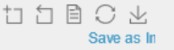

con esta opción se obtiene un archivo denominado automáticamente '*Climatología 1979-2018*' y tiene formato de imagen PNG.

